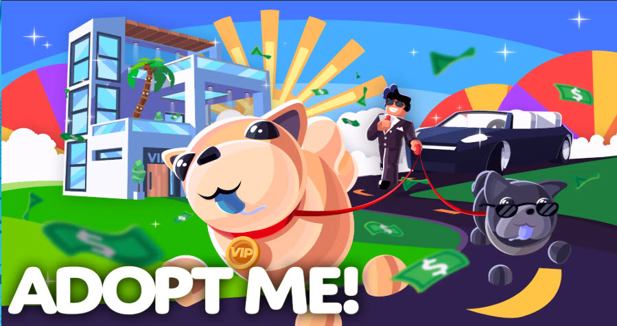

# ADOPTIONS - Entrega Final Backend 03

`<email>` : <guillermoaballester@gmail.com>

`<docker project image>` : <https://hub.docker.com/r/coder70000gab/adoptions>

`<Swagger documentation example>` : <http://localhost:8080/apidocs/>

The pets  and users mocking generation, is available in test script. The test script delete the mongosse database data, and populate this with the calls into test execution script.

In a normal environment, the repository would be uploaded to GitHub without the tests, but since they are part of this submission and must be evaluated, they are included.

To run the test use npm run test, that have an speciall setttings timeout.
